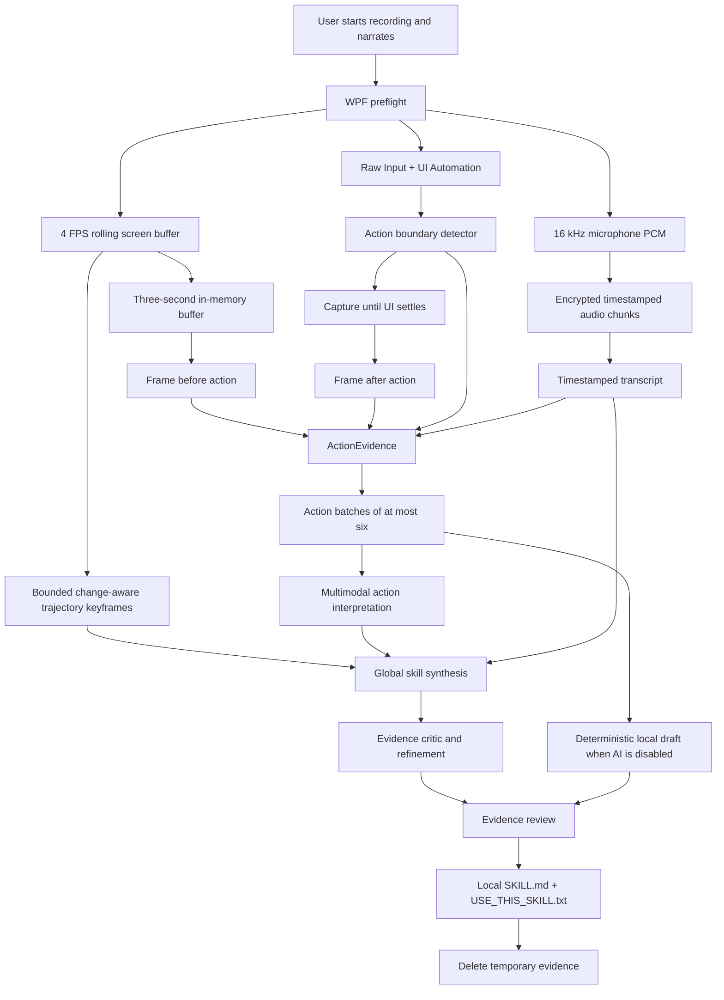

# SkillMyScreen v0.2 architecture

SkillMyScreen records a narrated Windows workflow, pairs every logical interaction with before/after screen evidence, and stops after saving a reviewed local `SKILL.md` plus a universal agent prompt.

## Technology

- C# and WPF on .NET 10.
- Native GDI-compatible screen sampling, Raw Input, Win32 window context, and Windows UI Automation.
- Native microphone capture at 16 kHz mono PCM with five-second encrypted chunks.
- AES-GCM temporary artifacts with a DPAPI-protected session key.
- `HttpClient` BYOK adapters for action-level vision/audio interpretation, complete-trajectory synthesis, critic refinement, transcription, and explicit capability fallbacks.
- Supplied cyan/monochrome branding assets embedded as WPF resources and the application icon.
- Self-contained single-file `win-x64` and `win-arm64` EXEs.

## Product boundary

The durable product output is a local `SKILL.md` and a universal prompt. SkillMyScreen does not execute skills, host MCP, inject input, install a browser, create a database, run a background service, require administrator access, or collect telemetry.
