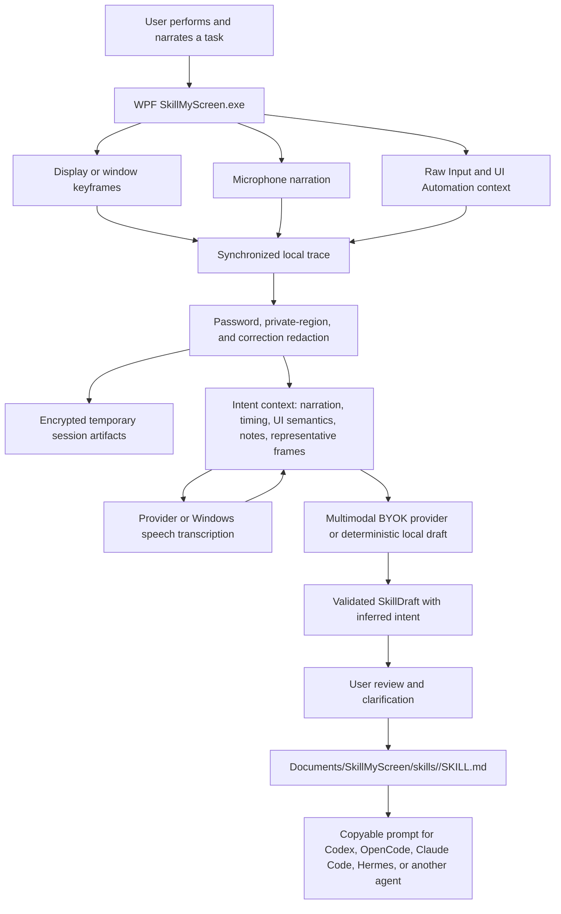

# SkillMyScreen native Windows EXE

SkillMyScreen records a user-demonstrated computer workflow and stops after creating a reviewed local `SKILL.md` and a copyable prompt for another agent.

## Technology

- C# and WPF on .NET 10.
- Native Windows screen keyframes, microphone capture, Raw Input, Win32 window context, and Windows UI Automation.
- AES-GCM temporary artifacts with a DPAPI-protected session key.
- `HttpClient` BYOK adapters for OpenAI-compatible providers, Anthropic, and Gemini.
- Provider transcription, Gemini inline audio, and Windows speech fallback feed narration into intent analysis.
- Representative encrypted frames and UI semantics are passed to multimodal providers when supported.
- Self-contained single-file `win-x64` and `win-arm64` EXEs; code signing remains a distribution task.

## Product boundary

The only durable product artifact is `SKILL.md`. SkillMyScreen does not run the skill, host an MCP server, inject input, start a background service, require administrator access, install a browser, or create a database. The receiving agent must already have the tools needed to execute the instructions.
