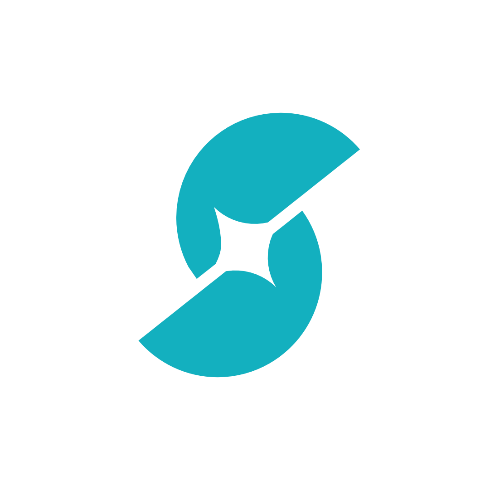

  <picture>
    <source media="(prefers-color-scheme: dark)" srcset="src/OhMySkill/Assets/Branding/p3.png">
    <source media="(prefers-color-scheme: light)" srcset="src/OhMySkill/Assets/Branding/p2.png">
    
  </picture>

# Oh My Skill

The v0.2 desktop shell uses the supplied cyan Oh My Skill mark for dark and light surfaces, with monochrome variants for high-contrast contexts. Branding assets live under `src/OhMySkill/Assets/Branding`.

Oh My Skill is a local-first Windows desktop application that turns a demonstrated computer workflow into a reviewed, portable <code>SKILL.md</code> file for an AI agent.

It is designed for work that happens anywhere on a Windows computer—not only in a browser. Demonstrate a task in a desktop application, file manager, terminal, browser, or mixed workflow; explain the intent through the microphone; review the generated instructions; then save the skill locally and paste the included agent prompt into Codex, OpenCode, Claude Code, Hermes, or another agent that can use the required computer tools.

The v0.2 workflow targets the user-visible “Record a Skill” pattern: record a demonstration with narration, interpret each action, synthesize the full trajectory, review the result, and save a portable skill. It does not claim to reproduce another product’s unpublished internal implementation.

> **Status:** v0.2.1 open-source preview. It uses synchronized action-level audio/visual interpretation, full-trajectory context, synthesis, and an evidence critic. Recording finalization, evidence loading, transcription, and saving now report visible progress without blocking the WPF window. The repository includes a fail-closed Microsoft Artifact Signing release workflow for future trusted production builds.

See [RELEASE_NOTES.md](RELEASE_NOTES.md) for the v0.2.1 release scope and
[BRANDING.md](BRANDING.md) for the original logo artwork and usage map.

## Product boundary

Oh My Skill deliberately stops at the portable skill document.

- It records evidence from a user demonstration.
- It creates a deterministic local draft or an optional BYOK AI draft.
- It gives the user a review and correction step.
- It saves one durable <code>SKILL.md</code> and copies a prompt that tells another agent to read it.
- It does **not** execute the skill, inject mouse or keyboard actions, host an MCP server, install a browser, run a background service, or create a database.

The receiving agent must already have the tools and permissions needed to execute the instructions. This keeps the builder small, inspectable, and safer to run on a personal Windows machine.

See [INSTALLATION.md](INSTALLATION.md) for portable EXE download, architecture selection, privacy access, source builds, and SmartScreen guidance.

## How it works

~~~mermaid
flowchart TB
    USER["User demonstrates a repeatable computer task"] --> UI["WPF desktop app"]
    UI --> CAPTURE["Display or selected-window keyframes"]
    UI --> MIC["Microphone narration"]
    UI --> INPUT["Raw Input and UI Automation context"]
    CAPTURE --> TRACE["Timestamped local recording trace"]
    MIC --> TRACE
    INPUT --> TRACE
    TRACE --> PROTECT["User redaction + encrypted temporary files"]
    PROTECT --> DRAFT["Deterministic local draft"]
    PROTECT --> BYOK["Optional BYOK provider"]
    BYOK --> DRAFT
    DRAFT --> REVIEW["User reviews and edits the draft"]
    REVIEW --> SKILL["Documents/Oh My Skill/skills/<slug>/SKILL.md"]
    REVIEW --> PROMPT["Copyable prompt for the receiving agent"]
~~~

### Recording

1. Choose **Entire display** or a visible window.
2. Start recording and perform the task normally.
3. Oh My Skill samples a short rolling frame buffer, stores a perceptually settled before/after pair for each logical action, keeps bounded trajectory keyframes, records encrypted timestamped microphone chunks, and captures high-level interaction context.
4. Use **Mark Step** when an action is especially meaningful.
5. Use **Redact Last 15 Seconds** if the recent portion should not be retained.
6. Finish the recording to build a draft.

The recorder intentionally does not persist ordinary typed characters. It groups typing into semantic text-entry bursts, records shortcuts such as Enter, Tab, Escape, and modifier combinations, and attaches focused-control metadata when Windows UI Automation exposes it. Password targets are marked protected and never include their values. Redact immediately if sensitive screen or narration evidence appears accidentally.

### Drafting

With AI disabled, the app converts the captured event timeline into a deterministic draft with explicit safety, verification, recovery, and uncertainty sections.

With AI enabled, the app works in three bounded stages: up to six actions are interpreted per multimodal request using paired frames, nearby narration, interaction metadata, and native audio where supported; the ordered interpretations and full transcript are synthesized into a <code>SkillDraft</code>; then a critic checks the draft for omissions, unsupported steps, run-specific values, corrections, safety, and observable verification. Invalid JSON or an invalid draft is rejected. If a provider stage fails, the app records the downgrade and keeps deterministic local evidence available.

### Review and output

The review page exposes the skill name, description, goal, inputs, procedure, safety, verification, recovery, and a Markdown preview. Saving creates a new folder under:

~~~text
%USERPROFILE%\Documents\Oh My Skill\skills\<skill-slug>\SKILL.md
~~~

The prompt copied to the clipboard tells the receiving agent to read that exact file before acting, follow its safety and verification rules, ask about missing inputs, and report the final verification result.

## Current capabilities

| Area | Current implementation |
| --- | --- |
| Computer scope | Windows desktop workflows across browsers, desktop applications, file managers, terminals, and mixed workflows |
| Screen evidence | Native GDI-compatible 4 FPS rolling buffer, perceptually settled encrypted before/after evidence per action, and bounded change-aware trajectory keyframes |
| Audio | Native <code>winmm</code> microphone capture to encrypted five-second 16 kHz mono chunks, live input level, and 30-second transcription windows |
| Interaction context | Raw Input clicks, double-clicks, drags, scroll bursts, shortcuts, privacy-safe text-entry bursts, foreground process/window, and Windows UI Automation targets |
| Context assembly | Timestamped narration is attached to actions; paired frames and optional native audio are interpreted in six-action batches; the complete ordered trajectory is then synthesized and critic-checked |
| Local drafting | Deterministic <code>DraftFactory</code> that produces a reviewable <code>SkillDraft</code> without a network call |
| BYOK drafting | Action interpretation, global synthesis, and critic refinement through OpenAI-compatible chat completions, Anthropic Messages images, and Google Gemini <code>generateContent</code>; native audio is attempted only for OpenAI and Gemini |
| Transcription | OpenAI-compatible <code>/audio/transcriptions</code>, Gemini inline-audio transcription, and Windows Speech fallback when no remote transcription path is available |
| Provider catalog | OpenAI, Anthropic, Gemini, OpenRouter, Nous Portal, Groq, Mistral, xAI, DeepSeek, Cerebras, Together, Fireworks, NovitaAI, GLM, Moonshot, MiniMax, Qwen, Hugging Face, NVIDIA NIM, Azure AI Foundry, OpenCode Zen/Go, DeepInfra, Ollama Cloud, Ollama, LM Studio, and custom OpenAI-compatible endpoints |
| Privacy controls | Explicit recording warning, recent-window redaction, encrypted temporary artifacts, and automatic cleanup after a successful save |
| Output | One Markdown skill with YAML frontmatter plus a copyable agent prompt |
| Distribution | Self-contained single-file <code>win-x64</code> and <code>win-arm64</code> builds; no .NET runtime required for end users |

The provider catalog is broader than the number of protocol adapters. Providers that expose an OpenAI-compatible API use the generic adapter and may require a provider-specific endpoint and model. Anthropic and Gemini have dedicated request formats. Each provider/model combination still needs live validation before being described as production-ready.

## Technology stack

| Layer | Technology | Why it is used |
| --- | --- | --- |
| Desktop UI | C# and WPF on .NET 10 | Native Windows windowing and a small distributable surface |
| Screen capture | Win32 <code>user32.dll</code>, GDI-compatible <code>System.Drawing</code> | Captures display/window evidence without a browser or extension |
| Microphone | Win32 <code>winmm.dll</code> wave-in API | Low-dependency microphone capture with no third-party recorder service |
| Interaction | Win32 Raw Input | Receives high-level mouse/shortcut events while the recorder is active |
| UI semantics | Windows UI Automation | Adds control name, automation id, control type, class, bounds, process, and window context when available |
| Temporary protection | AES-GCM plus Windows DPAPI (<code>CurrentUser</code>) | Protects session material locally and binds the saved key to the Windows user |
| Provider calls | <code>HttpClient</code>, JSON, multipart HTTP | Keeps BYOK integrations direct and avoids a hosted backend |
| Serialization | <code>System.Text.Json</code> | Serializes traces, settings, and provider drafts |
| Packaging | .NET single-file self-contained publish | Users can run the EXE without installing .NET |
| Validation | Built-in <code>--self-check</code> executable path | Verifies slugging, Markdown rendering, prompt paths, file save, and AES-GCM round-trip |

The requested execution level is <code>asInvoker</code>; the application does not request administrator rights.

## Privacy and data lifecycle

Oh My Skill is local-first, but screen and microphone capture are inherently sensitive. The user remains responsible for what appears during a demonstration.

### Temporary session data

While recording, encrypted temporary data is written under:

~~~text
%LOCALAPPDATA%\Oh My Skill\sessions\<recording-id>\
  key.dpapi
  trace.json.enc
  audio.wav.enc              (when a microphone is available)
  frames\*.enc
~~~

Each session uses a random AES-GCM key. The key is protected with Windows DPAPI for the current user. After <code>SKILL.md</code> is saved, the temporary session folder is deleted.

Redacting the recent recording window removes its events, action frames, trajectory frames, transcript associations, and precise PCM time range. The corresponding five-second encrypted audio chunks contain silence for redacted samples before transcription or provider use.

### Settings and API keys

Provider settings are stored at:

~~~text
%LOCALAPPDATA%\Oh My Skill\settings.json
~~~

The API key is stored as DPAPI-protected ciphertext, not as clear text. Keys are never written to the repository, logs, generated Markdown, or the clipboard prompt. Leaving the API key field blank keeps the existing protected value.

### What is and is not sent to a provider

- No provider call is made when AI is disabled.
- When AI is enabled, each action batch may send its before/after frames, nearby transcript, semantic interaction metadata, and one overlapping audio window when that adapter supports native audio. Synthesis and criticism use the transcript and action interpretations rather than resending the entire recording.
- Encrypted files are decrypted only in memory for provider requests. The evidence summary states whether vision/native audio was used or whether the request was downgraded to transcript and metadata.
- Provider retention, logging, and training policies are outside this application; choose a provider and account appropriate for the data being demonstrated.

## Windows permissions and compatibility

The app is designed to run without elevation and without a background service. Windows may still require user-level privacy approval for microphone access. UI Automation metadata can be unavailable when the target application is elevated or exposes limited accessibility information.

Supported targets:

- Windows 10 version 19041 or later, and Windows 11.
- Intel/AMD 64-bit Windows: use <code>win-x64</code>.
- ARM64 Windows: use <code>win-arm64</code>.
- A microphone is optional; screen and interaction recording continue when no microphone is available.

Local developer builds are unsigned. Public releases must be produced by the fail-closed Microsoft Artifact Signing workflow documented in [`SIGNING.md`](SIGNING.md); it signs and timestamps both architectures and rejects invalid output before publishing.

## Getting started

### Run a published build

Download and extract the architecture-appropriate ZIP from the repository Releases page. For most PCs, choose:

~~~text
OhMySkill-v0.2.1-win-x64.zip
~~~

Run `OhMySkill.exe` from the extracted folder. The app does not need the .NET runtime when using a self-contained release asset. The v0.2.1 release intentionally ships ZIPs so setup, license, and privacy information stay beside the executable instead of prompting a direct EXE download.

### Build from source

Requirements:

- Windows 10/11
- .NET 10 SDK
- A microphone only if narration is required

From the repository root:

~~~powershell
dotnet --version
dotnet restore .\OhMySkill.sln
dotnet build .\OhMySkill.sln -c Release
dotnet run --project .\tests\OhMySkill.SelfCheck\OhMySkill.SelfCheck.csproj -c Release
~~~

The self-check should print:

~~~text
Oh My Skill self-check passed.
~~~

The development build can also run its diagnostic path directly:

~~~powershell
dotnet run --project .\src\OhMySkill\OhMySkill.csproj -c Release -- --self-check
~~~

### Publish a self-contained EXE

~~~powershell
dotnet publish .\src\OhMySkill\OhMySkill.csproj -c Release -r win-x64 --self-contained true -p:PublishSingleFile=true -p:PublishTrimmed=false -o .\artifacts\win-x64
dotnet publish .\src\OhMySkill\OhMySkill.csproj -c Release -r win-arm64 --self-contained true -p:PublishSingleFile=true -p:PublishTrimmed=false -o .\artifacts\win-arm64
~~~

Run the packaged diagnostic:

~~~powershell
.\artifacts\win-x64\OhMySkill.exe --self-check
~~~

Build outputs and local SDK/cache folders are ignored by Git. Release assets should be attached to a GitHub Release rather than committed to the source tree.

## Project layout

~~~text
OhMySkill/
├── README.md                         Product, architecture, build, and privacy documentation
├── BRANDING.md                       Logo asset map and rights statement
├── CODE_SIGNING_POLICY.md            Release signing policy and roles
├── RELEASE_NOTES.md                  v0.2.1 release scope and limitations
├── ARCHITECTURE.md                   Short architecture overview and Mermaid flow
├── OhMySkill.sln                 Solution containing the app and self-check project
├── src/OhMySkill/
│   ├── MainWindow.xaml(.cs)          WPF UI and recording/review workflow
│   ├── CaptureService.cs             Window catalog, screen capture, microphone, recorder
│   ├── RawInputService.cs            Mouse and shortcut event observation
│   ├── UiAutomationService.cs        Semantic target lookup at the cursor
│   ├── ProviderService.cs             BYOK adapters, transcription, compiler prompt, draft factory
│   ├── StorageService.cs              DPAPI/AES-GCM storage, Markdown renderer, prompt builder
│   ├── Models.cs                     Trace, draft, provider, and output contracts
│   ├── SelfCheck.cs                  In-process diagnostic checks
│   └── app.manifest                  asInvoker and Windows compatibility declaration
├── tests/OhMySkill.SelfCheck/     Minimal executable validation project
└── artifacts/                         Local publish output; ignored from source commits
~~~

## Output contract

Every saved skill is a Markdown file with YAML frontmatter and predictable sections:

~~~markdown
---
name: "example-skill"
description: "A short description of the demonstrated workflow."
---

# Example skill

## Intent
...

## Goal
...

## Required inputs
...

## Preconditions
...

## Procedure
...

## Decision rules
...

## Safety
...

## Verification
...

## Recovery
...
~~~

The generated prompt is intentionally tool-agnostic. It tells an agent to read the file, use it as the procedural source of truth, ask for missing inputs, avoid guessing, request confirmation for sensitive external actions, and report verification. It does not assume that Codex, OpenCode, Claude Code, Hermes, or another agent has the same tool names.

## Provider configuration

1. Open **AI Settings**.
2. Select a provider.
3. Confirm or edit the endpoint and model.
4. Enter the API key and select **Use this provider to create the draft**.
5. Save settings and use **Test Connection** before recording a valuable workflow.

The generic adapter expects an OpenAI-compatible <code>/chat/completions</code> endpoint and, for transcription, <code>/audio/transcriptions</code>. Custom providers can be configured by selecting **Custom OpenAI-compatible** and entering the complete base endpoint. Do not place secrets in issue reports, screenshots, README files, or commits.

## Validation evidence

The current local build has been validated with:

- Release solution build on the x64 development machine.
- Release solution build on the ARM64 publish target.
- Built-in self-check for action/frame mapping, protected text-entry handling, perceptual settle detection, timestamped transcript prompts, Markdown rendering, validated atomic skill save, prompt path conversion, and AES-GCM encryption/decryption.
- Packaged x64 EXE launch smoke test.
- Packaged x64 <code>--self-check</code> execution.
- PE-header verification of both architecture outputs (<code>0x8664</code> x64 and <code>0xAA64</code> ARM64).

This is local evidence, not a claim that every provider, Windows edition, microphone driver, accessibility provider, or end-to-end AI workflow has been verified.

## Known limitations

- Capture is currently event- and keyframe-based; it is not a full video recorder.
- Windows Speech fallback depends on an installed Windows recognition language and may return no transcript on systems without a configured recognizer.
- OCR, clipboard semantics, exact drag paths, and application-specific APIs are not first-class evidence sources.
- Raw Input intentionally records high-level actions and text-entry bursts; it never reconstructs ordinary typed content.
- Provider catalog entries do not guarantee identical API semantics. Live model and endpoint tests are still required per provider.
- Generic OpenAI-compatible endpoints differ in image, audio, and JSON support. A rejected rich-media request is visibly downgraded to transcript/UI metadata, and each provider/model still needs a live test.
- Generated skills require human review. A recording is evidence, not proof that every inferred instruction is correct.
- The application creates instructions only; it does not execute or verify the workflow on the user's behalf.
- The first production signed release is blocked until a trusted public signing provider is provisioned and configured.

## Roadmap

The next improvements should follow the evidence boundary rather than add an agent runtime:

1. **Provider hardening:** provider-specific model defaults, compatible response parsing, retries/timeouts, endpoint diagnostics, and live capability tests.
2. **Capture fidelity:** pause/resume, stronger window lifecycle tracking, OCR where it adds evidence, and reliable multi-monitor capture.
3. **Distribution:** signed x64/ARM64 portable packages, release automation, update guidance, and Windows compatibility testing.
4. **Examples:** representative skills for file management, spreadsheet work, desktop forms, terminal workflows, and mixed browser/desktop tasks.

## Open source

Oh My Skill is released under the permissive [MIT License](LICENSE). The
project is open source so users can inspect the capture boundary, privacy
behavior, provider requests, and generated `SKILL.md` output before using it.
The repository's local-first behavior is documented in [PRIVACY.md](PRIVACY.md).

The project is applying for open-source code signing through the SignPath
Foundation. See the [code signing policy](CODE_SIGNING_POLICY.md). Until an
external signing program accepts the project, production releases continue to
use the fail-closed Microsoft Artifact Signing workflow described in
[SIGNING.md](SIGNING.md).

The Oh My Skill mark and supplied logo assets are original artwork created and
owned by the project maintainer. Permission to redistribute them with this
project is granted under the MIT License; modified distributions must not imply
endorsement. See [BRANDING.md](BRANDING.md).

## Contributing

Before opening a change:

1. Keep secrets, API keys, recordings, and personal screenshots out of the repository.
2. Make the smallest change that improves the capture-to-<code>SKILL.md</code> path.
3. Run the solution build and self-check.
4. If provider behavior changes, document the endpoint/model assumptions and test a real request with a locally supplied key.
5. Keep the product boundary explicit: no hidden automation executor, background service, MCP server, or telemetry without a separate design decision.

## Security and privacy reports

Do not publish captured recordings, API keys, or sensitive traces in a public issue. For a suspected security problem, use a private GitHub security report or contact the repository owner through GitHub with the minimum reproducible details.

## Code signing policy

See [CODE_SIGNING_POLICY.md](CODE_SIGNING_POLICY.md) for the current release
signing controls, maintainership roles, privacy statement, and sponsored
open-source signing status.

## License

Oh My Skill is available under the [MIT License](LICENSE). Contributions are
accepted under the same license unless a contributor and the project
maintainers agree otherwise in writing.
