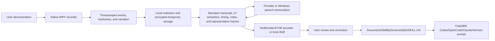

# SkillMyScreen native build

SkillMyScreen is a Windows-only, local-first `SKILL.md` builder. It records a demonstrated computer workflow and stops after producing a reviewed Markdown skill and a copyable prompt for another agent.

## Stack

- C# and WPF on .NET 10.
- Windows Graphics/GDI-compatible keyframes, native microphone capture, Raw Input, Win32 window context, and Windows UI Automation.
- AES-GCM temporary artifacts with a DPAPI-protected session key.
- `HttpClient` provider adapters for BYOK generation.
- Optional local models can be added through Foundry Local without changing the output contract.
- No MCP server, runtime executor, browser extension, database, background service, Node.js, Chromium, or open listening port.

The only durable product artifact is `SKILL.md`. The receiving agent must already have the tools required to execute it.
